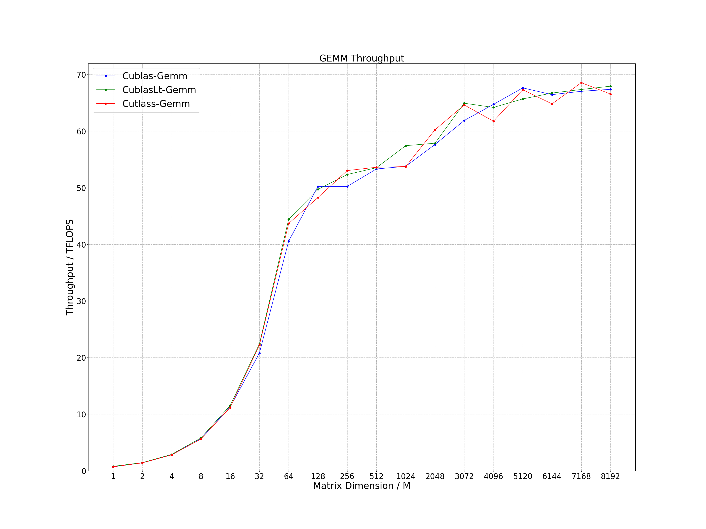
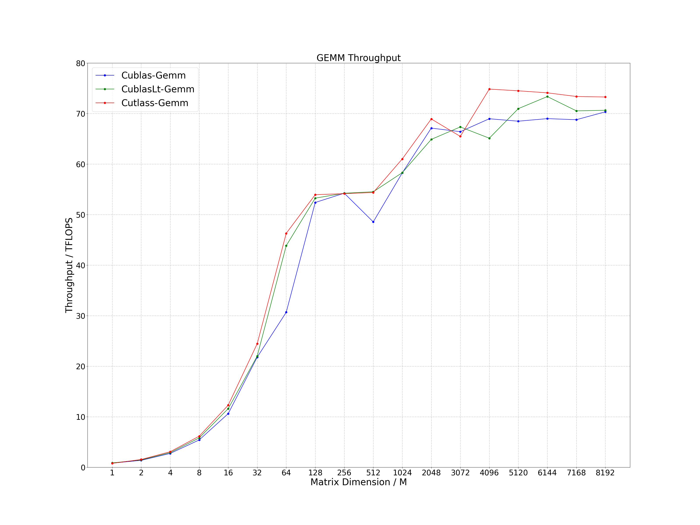

# CUTLASS GEMM
Multiple GEMM operators are constructed with cutlass to support LLM inference. 

## GEMM
The calculation expression is as follows, where the precision of Matrix A, B, C and D is FP16 or BF16. You can also customize your own epilogue. In some scenarios, it exceeds the performance of cublas and cublasLt.
```
D = alpha * (A * B) + beta * C
```

# Compile
## Environment
- OS: Linux
- Cmake Version: >= 3.16
- GCC Version: >= 5.0
- CUDA Version: >= 11.4
- Others: gflags, ccache
```
sudo apt-get install libgflags-dev ccache
```

## Clone
```
git clone https://github.com/Bruce-Lee-LY/cutlass_gemm.git
```

## Build
### NVIDIA A100
```
cd cutlass_gemm
./build.sh -a 80 -t Release -b OFF
./build.sh -a 80 -t Debug -b OFF
```

### RTX3080Ti / RTX3090 / RTX A6000
```
cd cutlass_gemm
./build.sh -a 86 -t Release -b OFF
./build.sh -a 86 -t Debug -b OFF
```

# Run Sample
```
./run_sample.sh
```

# Performance
Process the data in the log and plot it as a line chart.

```
cd tools/performance
./performance.sh
```

## GEMM
- GPU: RTX3090
- CUDA Version: 12.1
- Data Type: FP16
- Beta: 0.0

Performance achieved by current cutlass methods.

### K == N == 4096


### K == N == 8192


# Reference
- [cutlass](https://github.com/NVIDIA/cutlass): v3.5.1
> Add '#include <cute/numeric/math.hpp>' to file 'cute/algorithm/functional.hpp' to avoid error 'namespace "cute" has no member "max"' during compilation.

# TODO
- Add SM90 Kernel
